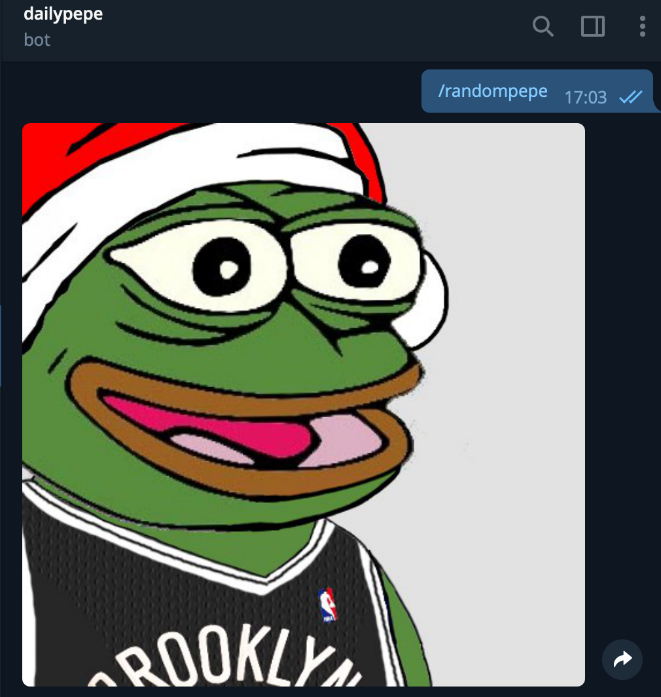

# Pepebot
[](https://t.me/dailypepebot)
> Telegram bot that gives you random pepes under the command `/randompepe/`

A basic serverless [Telegram bot](https://core.telegram.org/bots) using [Google Cloud Functions](https://cloud.google.com/functions/).

This bot runs with Python 3.7 and [python-telegram-bot](https://python-telegram-bot.org/).



## Development setup

Fully serverless implementation with cloud functions on gcloud. The bot retrieves pepes tagged as approved from a g-datastore instance.

## Deployment

First, deploy the bot to g-cloud functions
```
$ gcloud beta functions deploy webhook --set-env-vars "TELEGRAM_TOKEN=000:yyy" --runtime python37 --trigger-http --region europe-west2
```

This will return an output like:
```
Deploying function (may take a while - up to 2 minutes)...done.
availableMemoryMb: 128
entryPoint: webhook
environmentVariables:
  TELEGRAM_TOKEN: 000:yyyy
httpsTrigger:
  url: https://us-central1-<PROJECT_NAME>.cloudfunctions.net/webhook
labels:
  deployment-tool: cli-gcloud
name: projects/<PROJECT_NAME>/locations/us-central1/functions/webhook
runtime: python37
serviceAccountEmail: <PROJECT_NAME>@appspot.gserviceaccount.com
sourceUploadUrl: https://storage.googleapis.com/gcf-upload-us-central1-xxxxxx/...
status: ACTIVE
timeout: 3s
updateTime: '2018-09-03T16:18:32Z'
versionId: '1'
```

Copy the **httpsTrigger** path.

Now we need to set up the Webhook URL using this API call:

```
$ curl "https://api.telegram.org/bot<TELEGRAM_TOKEN>/setWebhook?url=https://us-central1-<PROJECT-NAME>.cloudfunctions.net/webhook"
```

You should <TELEGRAM_TOKEN> with the bot token and <PROJECT_NAME> with the ID of your Google Cloud project. If everything goes as planned you should see:
```
{
    "description": "Webhook was set",
    "ok": true,
    "result": true
}
```
And now you can test your bot with:

```
$ curl "https://us-central1-<PROJECT-NAME>.cloudfunctions.net/webhook"
ok
```
## TODOs
* The user should be able to set up a frequency to automatically recieve randompepes without the need to use /randomepep.
* Allow submitting pepes for later review and appending them to the master database.

## Release History

* 0.0.1
    * First release 

## Meta

Distributed under the MIT license. See ``LICENSE`` for more information.

[https://github.com/jiwidi/dailypepebot-cloud](https://github.com/jiwidi/)

## Contributing

1. Fork it (<https://github.com/jiwidi/dailypepebot-cloud/fork>)
2. Create your feature branch (`git checkout -b feature/fooBar`)
3. Commit your changes (`git commit -am 'Add some fooBar'`)
4. Push to the branch (`git push origin feature/fooBar`)
5. Create a new Pull Request

